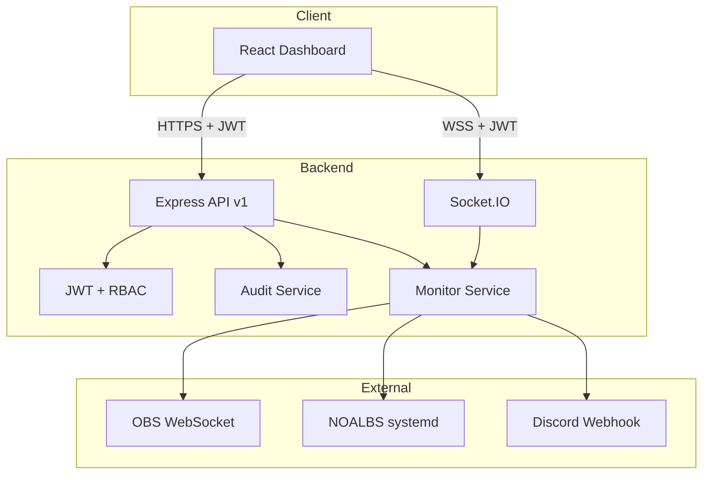

# Architektur – Stream Control Center v2.0

## Systemübersicht



## Backend-Schichten

```
backend/src/
├── auth/           # JWT, TOTP, UserStore, RBAC
├── audit/          # Audit-Logging
├── config/         # Zod-validierte Umgebung
├── middleware/     # Auth, RateLimit, Validate, ErrorHandler
├── observability/  # Pino Logger, Prometheus Metrics
├── routes/v1/      # Versionierte REST API
├── schemas/        # Zod Request Schemas
├── services/       # Domänenlogik
├── socket/         # Authentifizierte WebSocket-Events
└── utils/          # Sichere Shell, Sanitization
```

## Datenfluss Monitoring

1. `MonitorService.collectDashboardData()` sammelt parallel:
   - SystemService (CPU, RAM, Disk, Netzwerk)
   - StreamingService (OBS, NOALBS, Docker)
   - NetworkService (Ping, Latenz, Paketverlust)

2. `NotificationService` prüft Schwellwerte und erzeugt Alerts

3. `AlertDeliveryService` sendet Discord/E-Mail-Benachrichtigungen

4. Socket.IO broadcastet `dashboard:update` alle 5 Sekunden

## Frontend-Architektur

```
frontend/src/
├── api/            # Typed API Client mit Token-Refresh
├── components/     # UI-Komponenten
├── hooks/          # Socket, Polling, Initial Data
├── pages/          # Route-basierte Seiten
├── store/          # Zustand (Auth, Theme, Dashboard)
└── types/          # Shared TypeScript Types
```

### Seiten

| Route | Beschreibung |
|-------|-------------|
| `/` | Dashboard mit Live-Widgets |
| `/metrics` | Live-Charts (CPU, RAM, Netzwerk) |
| `/health` | System Health Checks |
| `/logs` | OBS, NOALBS, App Logs |
| `/alerts` | Alert-Historie & Konfiguration |
| `/audit` | Durchsuchbare Audit-Logs |
| `/backup` | Backup erstellen/wiederherstellen |
| `/settings` | Theme, Präferenzen |

## Deployment-Profile

### Production (`docker compose --profile production`)

- Non-root, read-only, capability-dropped
- Host-Netzwerk für OBS/systemd
- Persistentes Volume für `/app/data`

### Development (`docker compose --profile development`)

- Mock-Modus
- Port-Mapping 3001:3001
- Source-Mounts für Hot-Reload

## API-Versionierung

- Basis: `/api/v1/`
- OpenAPI: `/api/v1/docs`
- Metrics: `/api/v1/metrics` (Prometheus)
- Health (unauthentifiziert): `/api/health`
